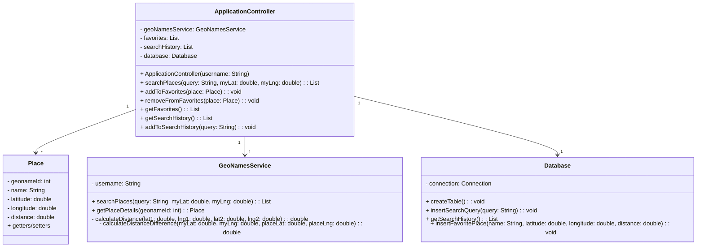
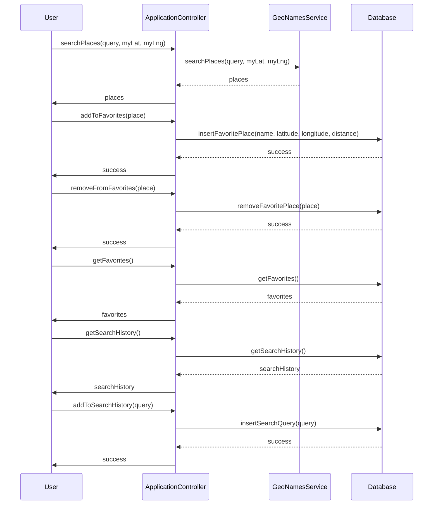

## Diagrama de Clases

```mermaid
classDiagram
  class ApplicationController {
    - geoNamesService: GeoNamesService
    - favorites: List<Place>
    - searchHistory: List<String>
    - database: Database
    + ApplicationController(username: String)
    + searchPlaces(query: String, myLat: double, myLng: double): List<Place>
    + addToFavorites(place: Place): void
    + removeFromFavorites(place: Place): void
    + getFavorites(): List<Place>
    + getSearchHistory(): List<String>
    + addToSearchHistory(query: String): void
  }

  class Place {
    - geonameId: int
    - name: String
    - latitude: double
    - longitude: double
    - distance: double
    + getters/setters
  }

  class GeoNamesService {
    - username: String
    + searchPlaces(query: String, myLat: double, myLng: double): List<Place>
    + getPlaceDetails(geonameId: int): Place
    - calculateDistance(lat1: double, lng1: double, lat2: double, lng2: double): double
    - calculateDistanceDifference(myLat: double, myLng: double, placeLat: double, placeLng: double): double
  }

  class Database {
    - connection: Connection
    + createTable(): void
    + insertSearchQuery(query: String): void
    + getSearchHistory(): List<String>
    + insertFavoritePlace(name: String, latitude: double, longitude: double, distance: double): void
  }

  ApplicationController "1" --> "*" Place
  ApplicationController "1" --> "1" GeoNamesService
  ApplicationController "1" --> "1" Database
```
## Diagrama de Frecuencia

```mermaid
sequenceDiagram
    participant User
    participant ApplicationController
    participant GeoNamesService
    participant Database

    User ->> ApplicationController: searchPlaces(query, myLat, myLng)
    ApplicationController ->> GeoNamesService: searchPlaces(query, myLat, myLng)
    GeoNamesService -->> ApplicationController: places
    ApplicationController ->> User: places

    User ->> ApplicationController: addToFavorites(place)
    ApplicationController ->> Database: insertFavoritePlace(name, latitude, longitude, distance)
    Database -->> ApplicationController: success
    ApplicationController ->> User: success

    User ->> ApplicationController: removeFromFavorites(place)
    ApplicationController ->> Database: removeFavoritePlace(place)
    Database -->> ApplicationController: success
    ApplicationController ->> User: success

    User ->> ApplicationController: getFavorites()
    ApplicationController ->> Database: getFavorites()
    Database -->> ApplicationController: favorites
    ApplicationController ->> User: favorites

    User ->> ApplicationController: getSearchHistory()
    ApplicationController ->> Database: getSearchHistory()
    Database -->> ApplicationController: searchHistory
    ApplicationController ->> User: searchHistory

    User ->> ApplicationController: addToSearchHistory(query)
    ApplicationController ->> Database: insertSearchQuery(query)
    Database -->> ApplicationController: success
    ApplicationController ->> User: success
```
